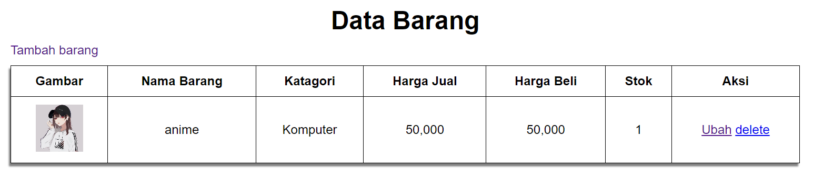
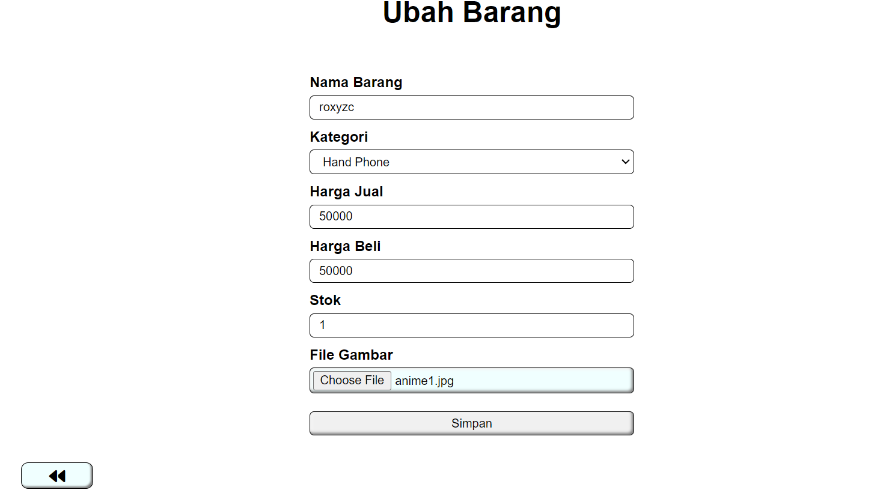

# lab3web
**<p>Nama: Ridho Pikriyansyah</p>**
**<p>Kelas: TI.21.A.3</p>**
**<p>NIM: 312110169</p>**

## koneksi.php

### Code
```
<?php
$host = "localhost";
$user = "root";
$pass = "";
$db = "latihan1";
$conn = mysqli_connect($host, $user, $pass, $db);
if ($conn == false) {
    echo "Koneksi ke server gagal.";
    die();
}
```

### Penjelasan
> Pada code diatas digunakan untuk menghubungkan ke database yang bernama "latihan1"

## index.php

### Output


### Code
```
<?php
include("koneksi.php");
// query untuk menampilkan data
$sql = 'SELECT * FROM data_barang';
$result = mysqli_query($conn, $sql);
?>
<!DOCTYPE html>
<html lang="en">

<head>
    <meta charset="UTF-8">
    <link href="./styles/style.css" rel="stylesheet" type="text/css" />
    <title>Data Barang</title>
</head>

<body>
    <div class="container">
        <div class="main">
            <h1>Data Barang</h1>
            <a class="tambah" href="tambah.php">Tambah barang</a>
            <table>
                <tr>
                    <th>Gambar</th>
                    <th>Nama Barang</th>
                    <th>Katagori</th>
                    <th>Harga Jual</th>
                    <th>Harga Beli</th>
                    <th>Stok</th>
                    <th>Aksi</th>
                </tr>
                <?php if ($result) : ?>
                    <?php while ($row = mysqli_fetch_array($result)) : ?>
                        <tr>
                            <td>" alt="<?= $row['nama']; ?>"></td>
                            <td><?= $row['nama']; ?></td>
                            <td><?= $row['kategori']; ?></td>
                            <td><?= $row['harga_beli']; ?></td>
                            <td><?= $row['harga_jual']; ?></td>
                            <td><?= $row['stok']; ?></td>
                            <td><a href="ubah.php?id=<?= $row['id_barang']; ?>">Ubah</a> <a href="hapus.php?id=<?= $row["id_barang"]; ?>">delete</a></td>
                        </tr>
                    <?php endwhile;
                else : ?>
                    <tr>
                        <td colspan="7">Belum ada data</td>
                    </tr>
                <?php endif; ?>
            </table>
        </div>
    </div>
</body>

</html>
```

### Penjelasan
> Contoh diatas merupakan skrip PHP yang menghasilkan halaman HTML dan menampilkan data dari tabel database yang disebut "data_barang"

## tambah.php

### Output


### Code
```
<?php
error_reporting(E_ALL);
include_once 'koneksi.php';
if (isset($_POST['submit'])) {
    $nama = $_POST['nama'];
    $kategori = $_POST['kategori'];
    $harga_jual = $_POST['harga_jual'];
    $harga_beli = $_POST['harga_beli'];
    $stok = $_POST['stok'];
    $file_gambar = $_FILES['file_gambar'];
    $gambar = null;
    if (isset($file_gambar)) {
        $filename = str_replace(' ', '_', $file_gambar['name']);
        $destination = __DIR__ . "/img/" . $filename;
        if (move_uploaded_file($file_gambar['tmp_name'], $destination)) {
            $gambar = 'img/' . $filename;
        }
        $sql = 'INSERT INTO data_barang (nama, kategori,harga_jual, harga_beli, stok, gambar) ';
        $sql .= "VALUE ('{$nama}', '{$kategori}','{$harga_jual}', '{$harga_beli}', '{$stok}', '{$gambar}')";
        $result = mysqli_query($conn, $sql);
    }
    header('location: index.php');
}
?>
<!DOCTYPE html>
<html lang="en">

<head>
    <meta charset="UTF-8">
    <link href="./styles/style.css" rel="stylesheet" type="text/css" />
    <link rel="stylesheet" href="https://cdnjs.cloudflare.com/ajax/libs/font-awesome/6.3.0/css/all.min.css" integrity="sha512-SzlrxWUlpfuzQ+pcUCosxcglQRNAq/DZjVsC0lE40xsADsfeQoEypE+enwcOiGjk/bSuGGKHEyjSoQ1zVisanQ==" crossorigin="anonymous" referrerpolicy="no-referrer" />
    <title>Tambah Barang</title>
</head>

<body>
    <div class="container">
        <h1>Tambah Barang</h1>
        <div class="main">
            <form method="post" action="tambah.php" enctype="multipart/form-data">
                <div class="input">
                    <label>Nama Barang</label>
                    <input type="text" maxlength="30" name="nama" />
                </div>
                <div class="input">
                    <label>Kategori</label>
                    <select name="kategori">
                        <option value="Komputer">Komputer</option>
                        <option value="Elektronik">Elektronik</option>
                        <option value="Hand Phone">Hand Phone</option>
                    </select>
                </div>
                <div class="input">
                    <label>Harga Jual</label>
                    <input type="text" maxlength="12" name="harga_jual" />
                </div>
                <div class="input">
                    <label>Harga Beli</label>
                    <input type="text" maxlength="12" name="harga_beli" />
                </div>
                <div class="input">
                    <label>Stok</label>
                    <input type="text" maxlength="12" name="stok" />
                </div>
                <div class="input">
                    <label>File Gambar</label>
                    <div class="label">
                        <input type="file" name="file_gambar" />
                    </div>
                </div>
                <div class="submit">
                    <input type="submit" name="submit" value="Simpan" />
                </div>
            </form>
            <div class="back">
                <a href="index.php"><i class="fa-solid fa-backward"></i></a>
            </div>
        </div>
    </div>
</body>

</html>
```

### Penjelasan
> Code diatas merupakan form untuk menambahkan data pada table "data_barang"

## ubah.php

### Output


### Code
```
<?php
// error_reporting(E_ALL);
include_once 'koneksi.php';
if (isset($_POST['submit'])) {
    $id = $_POST['id'];
    $nama = $_POST['nama'];
    $kategori = $_POST['kategori'];
    $harga_jual = $_POST['harga_jual'];
    $harga_beli = $_POST['harga_beli'];
    $stok = $_POST['stok'];
    $file_gambar = $_FILES['file_gambar'];
    $gambar = null;

    if (isset($file_gambar)) {
        $filename = str_replace(' ', '_', $file_gambar['name']);
        $destination = __DIR__ . '/img/' . $filename;
        if (move_uploaded_file($file_gambar['tmp_name'], $destination)) {
            $gambar = 'img/' . $filename;;
        }
    }
    $sql = 'UPDATE data_barang SET ';
    $sql .= "nama = '{$nama}', kategori = '{$kategori}', ";
    $sql .= "harga_jual = '{$harga_jual}', harga_beli = '{$harga_beli}', stok = '{$stok}' ";
    if (!empty($gambar)) {
        $sql .= ", gambar = '{$gambar}' ";
    }
    $sql .= "WHERE id_barang = '{$id}'";
    $result = mysqli_query($conn, $sql);
    header('location: index.php');
}

$id = $_GET['id'];
$sql = "SELECT * FROM data_barang WHERE id_barang = '{$id}'";
$result = mysqli_query($conn, $sql);
if (mysqli_num_rows($result) == 0) {
    die('Error: Data tidak tersedia');
} else {
    $data = mysqli_fetch_array($result);
}

function is_select($var, $val)
{
    if ($var == $val) return 'selected="selected"';
    return false;
}

?>
<!DOCTYPE html>
<html lang="en">

<head>
    <meta charset="UTF-8">
    <link href="./styles/style.css" rel="stylesheet" type="text/css" />
    <link rel="stylesheet" href="https://cdnjs.cloudflare.com/ajax/libs/font-awesome/6.3.0/css/all.min.css" integrity="sha512-SzlrxWUlpfuzQ+pcUCosxcglQRNAq/DZjVsC0lE40xsADsfeQoEypE+enwcOiGjk/bSuGGKHEyjSoQ1zVisanQ==" crossorigin="anonymous" referrerpolicy="no-referrer" />
    <title>Ubah Barang</title>
</head>

<body>
    <div class="container">
        <h1>Ubah Barang</h1>
        <div class="main">
            <form method="post" action="ubah.php" enctype="multipart/form-data">
                <div class="input">
                    <label>Nama Barang</label>
                    <input type="text" maxlength="30" name="nama" value="<?php echo $data['nama']; ?>" />
                </div>
                <div class="input">
                    <label>Kategori</label>
                    <select name="kategori">
                        <option <?php echo is_select('Komputer', $data['kategori']); ?> value="Komputer">Komputer</option>
                        <option <?php echo is_select('Komputer', $data['kategori']); ?> value="Elektronik">Elektronik</option>
                        <option <?php echo is_select('Komputer', $data['kategori']); ?> value="Hand Phone">Hand Phone</option>
                    </select>
                </div>
                <div class="input">
                    <label>Harga Jual</label>
                    <input type="text" maxlength="12" name="harga_jual" value="<?php echo $data['harga_jual']; ?>" />
                </div>
                <div class="input">
                    <label>Harga Beli</label>
                    <input type="text" maxlength="12" name="harga_beli" value="<?php echo $data['harga_beli']; ?>" />
                </div>
                <div class="input">
                    <label>Stok</label>
                    <input type="text" maxlength="12" name="stok" value="<?php echo $data['stok']; ?>" />
                </div>
                <div class="input">
                    <label>File Gambar</label>
                    <div class="label">
                        <input type="file" name="file_gambar" />
                    </div>
                </div>
                <div class="submit">
                    <input type="hidden" name="id" value="<?php echo $data['id_barang']; ?>" />
                    <input type="submit" name="submit" value="Simpan" />
                </div>
            </form>
            <div class="back">
                <a href="index.php"><i class="fa-solid fa-backward"></i></a>
            </div>
        </div>
    </div>
</body>

</html>
```

### Penjelasan
> Code diatas merupakan form untuk merubah atau mengupdate suatu data dari table "data_barang" melalui sebuah "id"

## hapus.php

### Output _Sebelum dihapus_


### Output _Sesudah dihapus_


### Code
```
<?php
include_once 'koneksi.php';
$id = $_GET['id'];
$sql = "DELETE FROM data_barang WHERE id_barang = '{$id}'";
$result = mysqli_query($conn, $sql);

header('location: index.php');
```

### Penjelasan
> Code diatas merupakan contoh untuk menghapus data dari table "data_barang" melalui sebuah "id"
